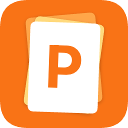
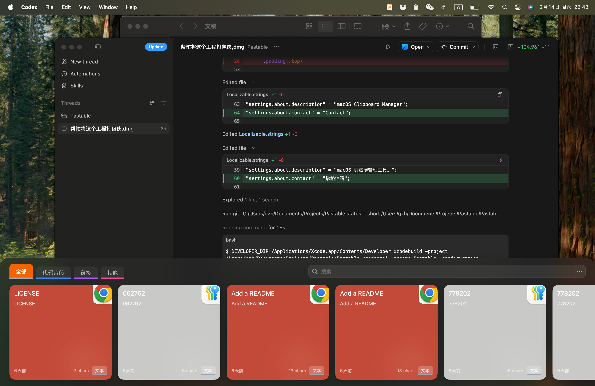

<div align="center">
  
  <h1>Pastable</h1>
  <p><strong>A lightweight and fast clipboard manager for macOS</strong></p>
  <p>Built around an instant floating panel and smarter search to make copy-paste workflows frictionless.</p>
  <p>
    <a href="./README.md">简体中文</a> ·
    <a href="./README.en.md">English</a>
  </p>
  <p>
    
    
    
    <a href="https://github.com/QiuZHsGitHub/Pastable/releases/latest"></a>
    
  </p>
</div>

<p align="center">
  
</p>

## Table of Contents

- [Highlights](#highlights)
- [Quick Start](#quick-start)
- [Download](#download)
- [Usage](#usage)
- [Settings](#settings)
- [Project Structure](#project-structure)
- [Inspirations](#inspirations)
- [License](#license)

## Highlights

- **Bottom floating panel**: instantly opens recent clipboard history
- **Smart search**: supports both exact and fuzzy matching
- **Auto content detection**: text, code, links, images, and files
- **One-click paste**: select a card to restore clipboard and paste immediately
- **History management**: retention window, capacity control, and manual cleanup
- **Custom shortcuts**: configurable global hotkey for panel toggle

## Quick Start

### 1) Clone

```bash
git clone https://github.com/QiuZHsGitHub/Pastable.git
cd Pastable
```

### 2) Install dependencies

Follow `./DEPENDENCIES.md` to add Swift Package dependencies in Xcode.

### 3) Run

1. Open `./Pastable.xcodeproj`
2. Select the `Pastable` scheme
3. Choose a macOS target and run

## Download

- Latest release: <https://github.com/QiuZHsGitHub/Pastable/releases/latest>
- Download the `.dmg` package from the release assets

## Usage

- **Toggle panel**: use your configured shortcut (default `Cmd + Shift + V`)
- **Focus search**: `Cmd + Shift + F`
- **Quick paste**: click a card to paste into the active app
- **Delete card**: hover a card and press `Cmd + Delete`

## Settings

- Search mode: Exact / Fuzzy
- Auto paste
- Remove formatting
- Sound feedback
- Save types: Text / Image / File
- History limit and retention duration

## Project Structure

```text
Pastable/
├── Core/          # lifecycle, clipboard monitor, search, theme
├── Models/        # history models and content parsing
├── Persistence/   # SwiftData persistence and dedup logic
├── UI/            # floating panel, cards, settings views
└── Extensions/    # shared extensions and pasteboard types
```

## Inspirations

- Raycast
- Alfred
- Pastebot
- Maccy
- Clipy

## License

This project is open-sourced under the [MIT License](./LICENSE).
